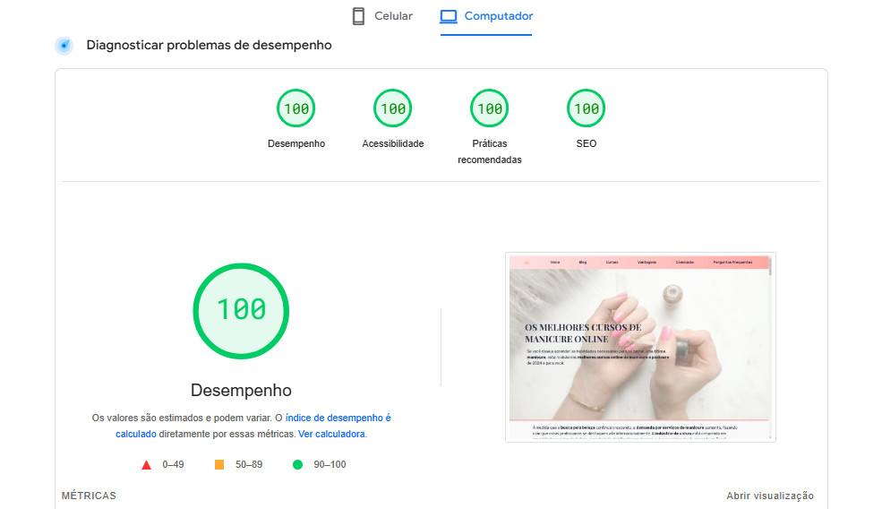

# Site de Reviews e Blog

Este é um projeto desenvolvido com o objetivo de oferecer uma visão completa e imparcial sobre os melhores cursos de manicure e pedicure disponíveis online. No site, o usuário pode explorar reviews detalhados, vantagens de cada curso e respostas às dúvidas mais comuns, com a possibilidade de comparar cursos e escolher o que mais se adequa às suas necessidades e aspirações profissionais.

Hospedado na Vercel e otimizado para SEO e performance, o site é totalmente responsivo e oferece uma experiência aprimorada tanto para usuários de dispositivos móveis quanto para tablets e desktops.

## ✨ Funcionalidades

### 📝 Página Principal - Reviews de Cursos

- <b>Descrição dos Cursos</b>: Listagem dos principais cursos com análises detalhadas, incluindo vantagens, diferenciais e principais informações sobre cada um.
- <b>Botões de Ação</b>: Cada curso conta com um botão de ação que direciona o usuário para a página de venda oficial.
- <b>Seção de Vantagens</b>: Descreve as principais vantagens dos cursos, ajudando o usuário a entender os benefícios de investir em cada um.
- <b>Perguntas Frequentes</b>: Responde às dúvidas mais comuns sobre os cursos de manicure e pedicure, facilitando a tomada de decisão.

### 📚 Blog

- <b>Artigos Complementares</b>: Conteúdo adicional que explora temas do universo da manicure e pedicure, com dicas, tendências e práticas do mercado. Este espaço visa atrair e engajar usuários, oferecendo informações relevantes e de valor.

## 🛠 Tecnologias Utilizadas

Este site foi construído utilizando as tecnologias básicas de desenvolvimento web:

- <b>HTML5</b>: Marcações semânticas para SEO e acessibilidade;
- <b>CSS3</b>: Design responsivo com abordagem "mobile-first" e uso de media queries para adaptação em telas de tablet e desktop;
- <b>JavaScript</b>: Interatividade básica e otimização da experiência do usuário.

## 🚀 Processo de Desenvolvimento

1. <b>Mobile-First</b>: Todo o design foi inicialmente concebido para dispositivos móveis, ajustando-se gradualmente para telas maiores via media queries.
2. <b>SEO e Indexação</b>: Site configurado com todas as meta tags essenciais para SEO e estruturação com robots.txt. O projeto foi cadastrado no <a href="https://search.google.com/search-console/about">Google Search Console</a> para monitoramento de indexação e análise de tráfego orgânico.
3. <b>Otimizações de Performance</b>:
   - <b>Imagens em Formato WebP</b>: Todas as imagens foram convertidas para WebP, com variações de tamanho para diferentes dispositivos.
   - <b>Preload de Fontes e CSS</b>: Priorização de recursos essenciais para melhorar o tempo de carregamento.
   - <b>Defer no JavaScript</b>: Scripts carregados de forma assíncrona para evitar bloqueio de renderização.
   - <b>Configurações de Cache</b>: Melhorias de cache para otimizar o carregamento nas visitas subsequentes.
4. <b>Auditoria e Melhoria de Performance</b>: Após concluir o desenvolvimento, o site foi auditado com o <a href="https://pagespeed.web.dev/">PageSpeed Insights</a>, com ajustes realizados para garantir pontuação máxima em: Performance; SEO; Boas Práticas e Acessibilidade.
5. 📊 <b>Dados Estruturados</b>: Implementação de dados estruturados para otimizar a visibilidade nas pesquisas do Google, exibindo informações detalhadas sobre os cursos diretamente nos resultados de busca e potencializando o tráfego orgânico.

## 🌐 Deploy

O site está hospedado na <a href="https://vercel.com">Vercel</a>, com integração ao Google Search Console para monitoramento de indexação e análise de tráfego.

## 👀 Como Visualizar o Projeto

Para ver o site ao vivo, acesse: <a href="https://melhorescursosdemanicureonline.vercel.app/index.html">Link para o Site</a>.

## 💯 Pontuação no Lighthouse

Após todas as otimizações, o site obteve pontuação máxima em:

## 🔍 Conclusão

Este projeto é um exemplo completo de site responsivo, otimizado para performance e SEO, com foco em oferecer uma experiência eficiente e de valor para o usuário.

### 👨‍💻 Desenvolvido por: <a href="https://github.com/daviteixeira-dev/">Davi Teixeira</a>
